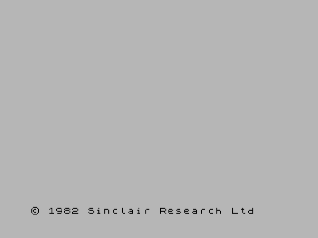
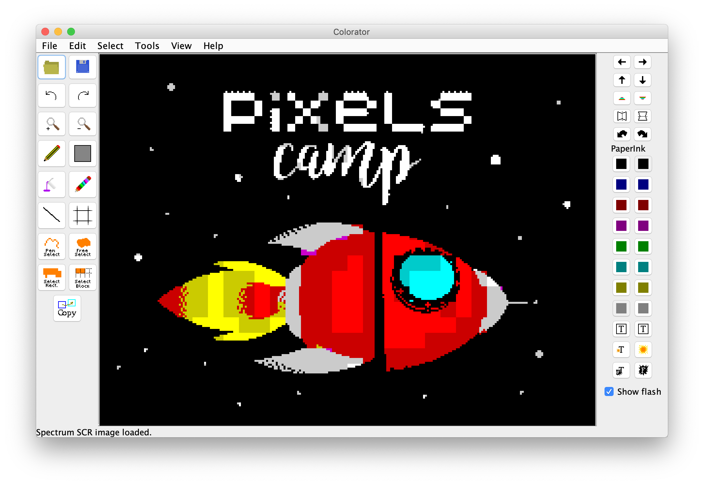

ZX Pixels
=========

ZX Spectrum 48K program, as part of the Pixels Camp v3.0 t-shirt [challenge][0].



This program was written using [ZXBasic][1], a Sinclair ZX Spectrum BASIC compiler for modern systems where you can use both an improved BASIC laguage and inline Z80 assembly where it makes sense. The resulting binary is then compiled, optimized and packed into a ready to use [TZX][15] file.

## Instalation

First install the [ZXBasic][1] toolkit as a subdirectory of this repo (don't worry, it's .gitignored):

```
git clone https://github.com/boriel/zxbasic
cd zxbasic
sudo easy_install .
./zxb.py
cd ..
```
Documentation for ZXBasic can be found [here][2].

Install [ZX80Asm][3].

```
brew install z80asm
```

If you use the [Vim editor][14], then this Z80 syntax [plugin][4] is handy.

## Building

We have a [Makefile][11] with everything you need to build pixels.tzx. Just type:

```
$ make
```

The binaries are in the build/ sub-directory.

## Graphics

The [Colorator][6] graphics editor works fine and allows you to import PNG files, paint them, and then export [SCR][5] screens.

Colorator requires Java. If you're on a Mac, this is now the best and cleanest way to install (and later remove) Java:

```
brew update
brew cask install java
```



## Tools

I've coded this tiny NodeJS [tool][7] that converts a [.SCR][5] file from [Colorator][6] into an includable [screen.bas][2019/zxspectrum/screens/rocket.bas] buffer, which can then be loaded directly to screen using this [assembly code][2019/zxspectrum/lib/putchars.bas].

To use:

```
$ ./tools/convert.js screens/screenshot.scr > screens/screenshot.bas
```

## Emulator

[Fuse][8] is a great ZX Spectrum emulator. OSX version [here][10].

Install, run it, and open the [pixels.tzx][10] to run this program.

Alternatively, you can use this ZX Spectrum emulator [in Javascript][18] and open [this URL][17] using the **load from web** feature.

## Credits

[Isa][16] did all the SCR graphics.

## Useful docs

* [SCR file specfications][5]
* [ZXBasic manual][2]
* ZX Spectrum screen layout [part 1][12] and [part 2][13]
* [TZX format][15]

[0]: https://killmaster.github.io/2019/03/24/the-tshirt-challenge
[1]: https://github.com/boriel/zxbasic
[2]: http://www.boriel.com/wiki/en/index.php/ZXBasic
[3]: https://www.nongnu.org/z80asm/
[4]: https://github.com/cpcsdk/vim-z80-democoding
[5]: http://www.zx-modules.de/fileformats/scrformat.html
[6]: https://github.com/yomboprime/colorator
[7]: https://github.com/PixelsCamp/tshirt-gate/blob/master/2019/zxspectrum/tools/convert.js
[8]: http://fuse-emulator.sourceforge.net/
[9]: https://fuse-for-macosx.sourceforge.io/
[10]: https://github.com/PixelsCamp/tshirt-gate/raw/master/2019/zxspectrum/releases/pixels.tzx
[11]: https://github.com/PixelsCamp/tshirt-gate/blob/master/2019/zxspectrum/Makefile
[12]: http://www.overtakenbyevents.com/lets-talk-about-the-zx-specrum-screen-layout/
[13]: http://www.overtakenbyevents.com/lets-talk-about-the-zx-specrum-screen-layout-part-two/
[14]: https://www.vim.org/
[15]: https://www.worldofspectrum.org/TZXformat.html
[16]: https://github.com/isacosta
[17]: https://raw.githubusercontent.com/PixelsCamp/tshirt-gate/master/2019/zxspectrum/releases/pixels.tzx
[18]: https://jsspeccy.zxdemo.org/
